# Statistiques

> - Anna Stephany
> - Fanny Delnondedieu
> - Quentin Gendarme
> - Matthieu Legrand
> - Mathis Grisel
> - Charly Ginevra

## Table des matières

[TOC]

## Statistiques descriptives unidimensionnelle 

les statistiques descriptives unidimensionnelle fournissent  une série de valeurs( paramètre et de dispersion) et de représentation ( diagramme et histogramme). Ceci permet d'analyser et decrire un échantillon ou une observation d'un variable.

Dans notre exemple, il s'agit du poids de la classe ou la taile de la classe.

### Paramètres de position

Les paramètres de position permettent de donner une valeur centrale vers quelle tend la série d'échantillon. Ceci permet de mieux conclure sur la distribution et ordre de grandeur de l'échantillon.

#### Moyenne

La moyenne est un paramètre visant à résumer toutes les données en une seule valeur.

- Symbole : $\bar x_A$ ou $\bar x$
- Formule :
  - Non-pondérée : $\bar x_A = {1\over n} \sum_{i=0}^{n} x_i$
  - Pondérée :  $W = {1\over \sum_{i=0}^{n} w_i} \sum_{i=0}^{n} w_ix_i$

Une bonne représentation visuelle de la moyenne est celle d'un point qui minimise la distance cumulative avec toutes les données:
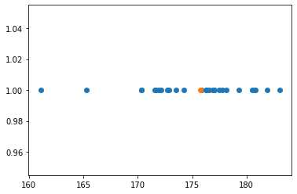

On peut vouloir apporter une importance non uniforme aux données. Pour se faire, nous allons utiliser des poids qui vont multiplier chacune des valeurs de données.

#### Quantile

Le quantile est un paramètre de position qui permet de connaître la valeur maximum des $N \over quantile$ premiers $x$

 il permettent de diviser l'échantillion en $q_{quantile}$ de même nombre d'effectif.

- Symbole : $q_{quantile}$
- Formule : 
  $$
  x_i où \ i \in \N \land i > {n \over quantile} \land min(i)
  $$

##### Quartile

Un quartile est un quantile de valeur spécifique. Il existe trois quartiles Q1, Q2 et Q3 qui représentent respectivement 25% 50% et 75% des données.

- Symboles :
  - $Q1$
  - $Q2$
  - $Q3$

Exemple: Pour Q1, le rang de la valeur qui nous intéresse est $\frac{31}{4} = 7.75 \approx 8$ -> 8ème rang

Q1= 172.5

Pour Q3, le rang de la valeur qui nous intéresse est $\frac{31}{4} \times 3 = 23.25 \approx 24$ -> 24ème rang

Q3= 177.5

*On arrondi toujours à l'entier supérieur.*

L’intervalle interquartile est donc : $Q3 - Q1 = 177.5-172.5 = 5$

##### Médiane

La médiane est le Q2. Elle indique la valeur centrale des données. Elle est souvent utilisée de pair avec la moyenne arithmétique car elle n'est pas sensible aux extrêmes.

Si la médiane est supérieure à la moyenne, alors il y a de petites valeurs dans l'extrême et inversement lorsque la médiane est inférieure.

- Symbole : $Q2$ ou $Me$

Calcul : 

Si l'effectif est pair : la médiane est la valeur situé à l'indice $\frac{effectif}{2}$. Par exemple si $N=30$ , la médiane est la valeur située à la 15e position des valeurs rangées par ordre croissant.

Si l'effectif est impair : la médiane est la moyenne des valeurs situées aux indices $\frac{effectif-1}{2}$ et $\frac{effectif+1}{2}$. Par exemple pour $N=31$ on a $N/2=15.5$ donc la médiane est la moyenne des valeurs situées aux indices 15 et 16.

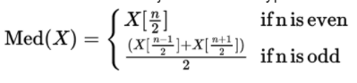

### Paramètres de dispersion

Dispersion statistique : la dispersion statistique mesure la variabilité des valeurs d’une série statistique par rapport à une valeur centrale (moyenne). Elle permet de déterminer la dispersion et l’écart entre les différentes valeurs.

#### Paramètres de dispersion absolue

##### Étendue

L'étendue est la différence entre la valeur minimale et maximale.

L'étendue de $X$ est $X_{max} - X_{min}$

##### Écart absolu moyen
Ce paramètre est la moyenne arithmétique de la valeur absolue des écarts à la moyenne. C'est donc la "distance moyenne à la moyenne".
$\frac{1}{n}\sum_{i=1}^n \left|x_i - \overline{x}\right|$

##### Variance
La variance est une mesure de la dispersion des valeurs d'un échantillon ou d'une distribution de probabilité.
- Symbole : $V$
- Formule :  $\frac{1}{n}\sum_{i=1}^n n_i\times(x_i-\overline{x})^2$
- Autre formule :  $E[X^2]-E[X]^2 = \frac{1}{n}\sum_{i=1}^n(n_i \times x_i^2) - (\bar x)^2$

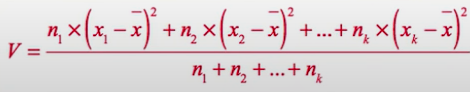

$x_i$ : valeur de la classe $i$ | Exemple : taille = 177.5cm

$n_i$ : effectif de la classe $i$ | Exemple : _**13**_ étudiants mesurent 177.5cm

$\bar x$ : moyenne des valeurs

##### Écart-type
L'écart-type est une mesure de dispersion par rapport à la moyenne.
- Symbole :  $\sigma$
- Formule : $\sigma = \sqrt{V}$

La règle des 68-95-99,7 stipule que :
* ~68% des valeurs se situent dans un intervalle de 1 écart-type autour de la moyenne.
* ~95% des valeurs se situent dans un intervalle de 2 écarts-types autour de la moyenne.
* ~99,7% des valeurs se situent dans un intervalle de 3 écarts-types autour de la moyenne.

#### Paramètres de dispersion relative
Les paramètres de dispersion relative permettent de comparer deux distributions à ordre de grandeur ou d’unité de mesure différente.

##### Le coefficient interquartile relatif
Un indicateur de dispersion moins sensible aux extremes comparé  à l'ecart type.
$$
C.I.R.(X) = {Q_3 - Q_1} \over Q_2
$$

##### L'ecart absolue moyen
Un indicateur de dispersion similaire à la variance mais avec un calcul plus simple.

$$
E.A.M (X) = {\frac {1}{n}}\sum _{i=1}^{n}\left|x_{i}-{\overline {x}}\right|
$$

##### L'écart moyen relatif
Cette indicateur est similaire a l'ecart moyen relatif mais il est relatif a un point central souvent la moyenne ca donne une mesure relative qui peut etre comparé avec d'autres donnés
$$
E.M.R.(X)  = {E.A.M.(X) \over \bar x}
$$

#### Mise en application sur notre jeu de données
tableau des poids :

|poids | 45-50 |  50-55 | 55-60 | 60-65 | 65-70 | 70-75 | 75-80 | 80-85 | 85-90 | 90-95 | 95-100 |
| ---  | ----- | -----  | ----- | ----- | ----- | ----- | ----- | ----- | ----- | ----- | -----  |
| eff. | 1     |    5   |   3   |   5   |  5    |    7  |  3    |   0   |  0    |  1    |   1    |

tableaux des tailles :

|taille| 160-165 |  165-170 | 170-175 | 175-180 | 180-185 | 185-190 | 
| ---  | ------- | -------  | ------- | ------- | ------- | ------- | 
| eff. | 1       |    1     |   11     |   13   |  5      |    0    |  

| Indicateur   | Taille (cm) | Masse (kg)  |
| ------------ | ----------- | ----------- |
| Min          | 162,5       | 47,5        |
| Max          | 182,5       | 97,5        |
| Moyenne      | 175,7258065 | 66,53225806 |
| Médiane      | 177,5       | 67,5        |
| 1er quartile | 172,5       | 57,5        |
| 3e  quartile | 177,5       | 72,5        |
| Variance     | 20,91397849 | 130,6989247 |
| Ecart-type   | 4.573180347 | 11.43236304 |

### Représentation

Il existe de nombreux types de diagramme permettant de représenter des données statistiques. Certaines réprsentations sont plus adaptées que d'autres, en fonction des types de données à analyser. Nous avons décidé de présenter et critiquer quelques diagrammes qui nous semblent pertinents à utiliser dans notre cas de figure.

#### Diagramme en bâtons

##### Description

Pour construire un diagramme en bâtons, il nous faut placer les points correspondant à nos valeurs sur un graphique. Pour chaque point, nous traçons un trait vertical le reliant à l'axe des abscisses.

##### Représentation

Pour le diagramme suivant, nous avons utilisé cette suite de points générée de manière aléatoire :

| x          | y          |
| ---------- | ---------- |
| 0.87009423 | 0.59815531 |
| 0.28730304 | 0.15536838 |
| 0.11426581 | 0.27674868 |
| 0.70423289 | 0.72387041 |
| 0.3701205  | 0.98997792 |

#### Diagramme cumulatif

##### Description

Ce diagramme permet de représenter graphiquement la distribution des effectifs. Il se base donc sur l’effectif cumulé. On peut exprimer l’effectif cumulé d’une valeur comme étant la somme de l’effectif de cette valeur additionné aux effectifs qui lui sont inférieurs.

##### Représentation

Pour cette partie, nous avons utilisé la suite de valeurs générée de manière aléatoire décrite ci-dessous. Par exemple, avec cette dernière, si l'on souhaite obtenir l’effectif cumulé de la 3ème valeur (v3), nous pouvons faire $1 + 2 + 1$ soit $4$. Si nous préférons celle de la 5ème, $v3 + 3 + 2$ soit $9$. 

| x   | y   |
| --- | --- |
| 1   | 1   |
| 2   | 2   |
| 3   | 1   |
| 4   | 3   |
| 5   | 2   |

La représentation graphique de l’effectif cumulé de la suite ci-dessus est la suivante :

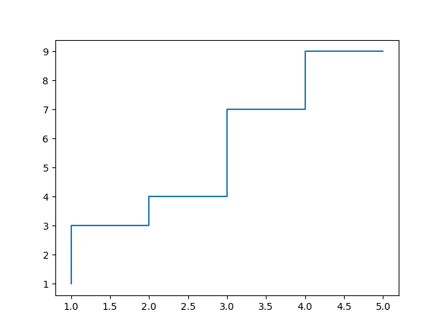

#### Histogramme

##### Description

L'histogramme représente la répartition empirique d'une variable aléatoire en la représentant avec des colonnes. Ces dernières portent le nom de **classes**.

Dans un histogramme, les classes sont représentées par un rectangle. La hauteur d'un rectangle représente la quantité de valeurs de cette classe.

Si l'on dispose d'une suite de valeurs, il existe plusieurs formules pour choisir le nombre de classes. Entre autres, il y a celle de Herbert Sturges qui définit que pour un nombre de valeurs $N$ on suggère un nombre de $K$ classes avec $K  = 1 + \log_{2}(N) \approx  1 + \frac{10}{3}\log_{10}(N)$ .

On parle de l'amplitude d'un histogramme comme étant la plage sur laquelle est définie l'histogramme. Elle se calcule avec la formule suivante : $A = Vmax - Vmin$ .

Par conséquent, la largeur d'une classe peut être calculée comme suit : $W = A / K$ .

L'histogramme est un moyen rapide et efficace d'analyser la répartition d'une certaine valeur.

##### Représentation

Pour le diagramme ci-dessous, nous avons utilisé les données relatives au poids des personnes de la classe ainsi que la bibliothèque [matplotlib](https://matplotlib.org/) de python.

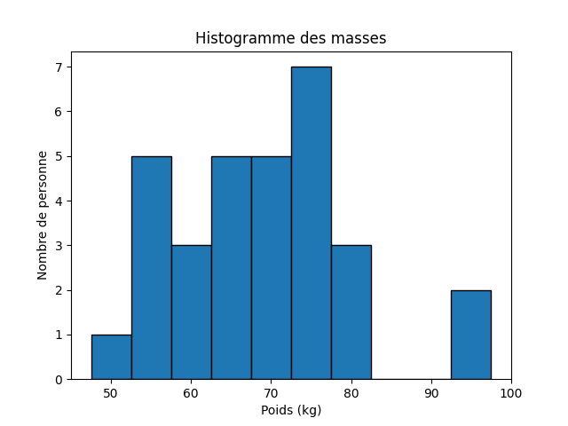

Dans notre cas, nous n'avons pas eu besoin de calculer le nombre de classes ainsi que leur largeur car les données prélevées l'ont été sur des plages de 5 en 5 ([45kg;50kg[,[50kg;55kg[, ...).

##### Histogramme à largeur variable

Il est possible de choisir des largeurs variables pour chaque classe de l'histogramme afin d'affiner la représentation. On peut choisir de prendre des intervalles plus larges là où la population est moins dense afin de réduire le bruit (données sont homogénéisées dans l'intervalle) et des intervalles plus étroits là où la population est la plus importante.

La difficulté est qu'on ne peut plus se contenter d'avoir la hauteur de chaque barre proportionnelle à l'effectif de leur classe car c'est l'aire qui doit être proportionelle à l'effectif et on la hauteur. Par exemple si on a deux classes :

| Classe :   | 0-100 | 50-100 |
|------------|-------|--------|
| Effectif : | 100   | 100    |

On aurait pu être tenté de donner une hauteur égale aux deux barres de l'histogramme car leur effectif est le même. Cependant on remarque que l'intervalle 0-100 est deux fois plus grand que l'intervalle 100-50 donc pour que les aires soient égales il faut que la première barre soit deux fois moins haute que la seconde :

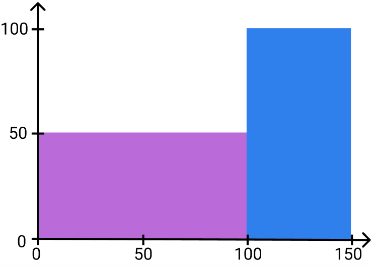

Ici un bean, une case délimité par une graduation verticale et une graduation horzontale correspond à un effectif de 50.

On peut donc calculer l'effectif réel ainsi :

* Pour la première barre : effectif = 50 * 2 (*car l'intervalle est sur 2 graduations*).
* Pour la seconde : effectif = 100 * 1

***Vidéo explicative YouTube - Les Bons Profs :***

[https://www.youtube.com/watch?v=IWyaMBV76EE](https://www.youtube.com/watch?v=IWyaMBV76EE)

#### Diagramme en boîte / box-plot

##### Description

Le diagramme en boîte, connu aussi sous le nom de boîte à moustaches ou boîte de Tukey, permet de visualiser l'essentiel d'une série statistique.

On y retrouve la médiane, les quartiles, la valeur minimale et maximale.

##### Représentation

Pour le diagramme ci-dessous, nous avons utilisé les données relatives au poids des personnes de la classe ainsi que la bibliothèque [matplotlib](https://matplotlib.org/) de python.

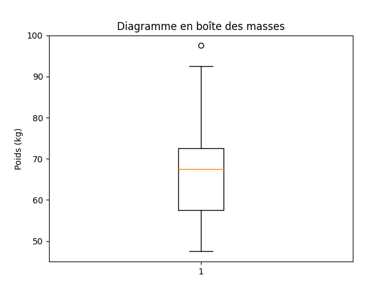

Sur ce diagramme, nous pouvons aisément identifier la médiane, (barre orange dans la boite), la valeur minimale (trait du bas), et la valeur maximale (trait du haut). La boîte intégre 25% des données inférieures et supérieures à son milieu. Ainsi la boite intègre 50% des valeurs totales.

Nous pouvons également remarquer que la valeur `97,5` est considérée comme aberrante car elle n'est pas à l'intérieur de la moustache. Ce cas de figure sous entend qu'il est parfois nécessaire d'en vérifier l'intégrité, afin de statuer de sa véracité. De ce fait, nous éliminons un grand nombre de valeurs aberrantes. À terme, nous nous sommes aperçus que c'était bien le cas ici.

## Statistiques descriptives bidimensionnelles

### Histogrammes 2D

Les histogrammes 2D permettent de visualiser la répartition des données et utilisent des couleurs pour en indiquer la concentration.

Comme les histogrammes en une seule dimension, les histogrammes 2D sont dépendants de la taille des divisions. Plus les divisions sont grandes, moins on a d'informations sur la distribution. À l'inverse, plus les divisions sont petites, plus elles sont sensibles au bruit. Il est aussi important de sélectionner correctement les couleurs utilisées pour représenter la concentration. En effet, les couleurs ne sont pas perçues linéairement.

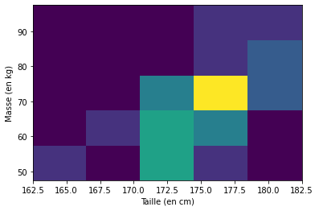

Un des problèmes principaux de l'histogramme 2D classique concerne sa répartition en corbeilles. Parfois, deux points éloignés se retrouvent dans la même corbeille, alors que d'autres points, plus proches, sont séparés. Une autre représentation similaire permet d'atténuer ce problème en utilisant des hexagones.

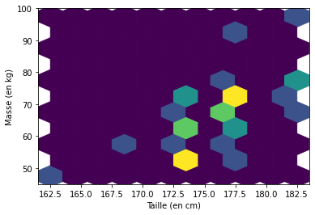

### Loi jointe
**Définition** : Soit (X,Y) un vecteur aléatoire réel. On appelle loi conjointe de (X,Y) la probabilité définie sur R2 par :
${P_{(X,Y)}(I \times J)=\mathbb {P} (X \in I\ et\ Y \in J)}$

Les lois de probabilité de $X$ et $Y$ sont alors appelées lois marginales de $(X,Y)$.

En particulier, lorsque $X$ et $Y$ sont à valeurs finies, la loi conjointe de $(X,Y)$ est l'ensemble des ${{P}((X=x_{i}) \cap (Y=y_{j})) }$

| Masse (kg) \ Taille (cm) | 160-165 | 165-170 | 170-175 | 175-180 | 180-185 | 185-190 | Cumulés |
| ------------------------ | ------- | ------- | ------- | ------- | ------- | ------- | ------- |
| 45-50                    | 1       |         |         |         |         |         | 1       |
| 50-55                    |         |         | 4       | 1       |         |         | 5       |
| 55-60                    |         | 1       | 1       | 1       |         |         | 3       |
| 60-65                    |         |         | 3       | 2       |         |         | 5       |
| 65-70                    |         |         | 1       | 3       | 1       |         | 5       |
| 70-75                    |         |         | 2       | 4       | 1       |         | 7       |
| 75-80                    |         |         |         | 1       | 2       |         | 3       |
| 80-85                    |         |         |         |         |         |         | 0       |
| 85-90                    |         |         |         |         |         |         | 0       |
| 90-95                    |         |         |         | 1       |         |         | 1       |
| 95-100                   |         |         |         |         | 1       |         | 1       |
| Cumulés                  | 1       | 1       | 11      | 13      | 5       | 0       | 31      |

### Loi unidirectionnelle ou marginale

La loi marginale d'une variable aléatoire à plusieurs dimensions est la loi de probabilité d'une de ses composantes.

Il est toujours possible, à l'aide de la loi conjointe, de retrouver les lois marginales :

si ${X(\Omega)= \{x_{1}, ... , x_{p}}\}$ et ${Y(\Omega)= \{y_{1}, ... , y_{p}}\}$,

on a : ${{P} (X = x_{i})=\sum _{j=1}^{q} {P} (X = x_{i}, Y = y_{j})}$

Si les composantes sont indépendantes, on a la propriété suivante :

${{P}(X = x_{i},Y = y_{j})= {P} (X = x_{i}) \times {P} (Y = y_{j})}$

sinon, dans le cas contraire, on a:

${{P}(X = x_{i},Y = y_{j})= {P} (X = x_{i}) \times {P} (Y = y_{j} | X = x_{i})}$

On peut toujours retrouver la loi marginale, à partir d u tableau de la loi jointe. Il suffit de regarder la ligne ou la colonne "cumulés".

### Loi conditionnelle

Une distribution conditionnelle est une distribution sattistique où on peut déduire VAR à partir d'une autre.

On a comme formule :

${P_X\big(\{x\}|(Y=y)\big)=\frac{P\big ( (X=x)\cap(Y=y)\big)}{P(Y=y)}}$

#### Paramètres de position et de dispersion
##### Moyenne 

C'est la moyenne des moyennes de chaque variable.

##### Moyenne de distance par rapport au point centrale  

Une maniere de caracteriser la dispersion d'une loi aleatoire 2D est de quantifier la distence moyenne entre le points de donné et un point centrale comme la moyenne.

$$
\frac{1}{n} \sum_{i=1}^{n} || {\bf z}_{i} - {\bf c} || 
\\
où
\\
c = (\bar x, \bar y)
$$

## Notions de dépendance 

### Espérance

L'espérance mathématique correspond à une moyenne pondérée des résultats d'une expérience aléatoire dans laquelle les facteurs de pondération sont les probabilités d'obtenir chacun des résultats.

Pour $X$, une variable aléatoire réelle prenant les valeurs $x1,...,x2$, la formule de l'espérance est la suivante:
$$
E(X) = \sum_{i=1}^{n} x_iP(X=x_i)
$$

### Covariance

La covariance est une mesure de la relation linéaire entre deux variables. C'est à dire, qu'elle nous permet de voir si deux variables aléatoires sont indépendantes (entre elles) ou pas.

Pour $X$ et $Y$, deux variables aléatoires, la covariance est définie par la formule suivante:
$$
Cov(X,Y) = E[(X - E[X])(Y - E[Y])] = E[XY] - E[X]E[Y]
$$

Cette dernière, un peu compliquée, peut se simplifier de la manière suivante:
$$
Cov(X,Y) = \frac{1}{(n-1)} \sum_{i=1}^{n} (xi - \bar{x})(yi - \bar{y}) 
$$

Si on calcule la covariance d'une variable aléatoire avec elle-même, on retombe sur la variance. On parle alors d'autocovariance. $Cov(X, X)=Var(X)$

Cela peut se démontrer aussi avec la formule "simplifiée". Si on prend deux variables aléatoires $X$ et $Y$, de telle sorte que $X = Y$, alors on se retrouve avec la formule de la variance.
$$
Cov(X,Y) = \frac{1}{(n-1)} \sum_{i=1}^{n} (xi - \bar{x})² 
$$

Si $X$ et $Y$ sont indépendantes alors $Cov(X,Y)=0$, mais l'inverse n'est pas forcément vrai.

La covariance est dite **symétrique** donc ${COV(X,Y) = COV(Y,X)}$. Ceci est démontrable avec le produit effectué, qui est commutable dans la formule avec l'espérance.

La covariance est dite **bilinéaire**. Voici la formule générale: ${COV(\sum_{i}^{} X_i , \sum_{j}^{} Y_j) = \sum_{i}^{} \sum_{j}^{} COV(X_i,Y_j)}$. Dans d'autres termes cela permet de dire que $Cov(X+Y, Z) = Cov(X,Z) + Cov(Y,Z)$ et que ${COV(cX,Y) = c*COV(X,Y)}$.

De la covariance, on peut savoir la "tendance" de nos variables aléatoires en fonction du signe du résultat.

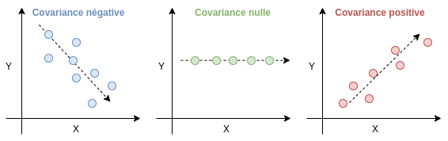

Mise à part ça c'est à peu près tout... La valeur ne veut pas dire grand chose. La covariance étant sensible à l'échelle si je prends les même variables aléatoires $X$ et $Y$ et que je multiplie leurs valeurs par un nombre quelconque, je n'aurai pas la même valeur de covariance. Elle même étant définie entre $-σ_xσ_y$ et $σ_xσ_y$.

Je ne peux pas non plus savoir si les points sont proches ou non de la ligne qui traverse le nuage. C'est là que la corrélation fait son entrée.

### Corrélation

La corrélation est la normalisation de la covariance. Elle n'est donc pas sensible à l'échelle.

Sa formule est la suivante:
$$
\rho(X,Y) = \dfrac {Cov(X,Y)} {\sqrt(Var(X) Var(Y))} = \dfrac {Cov(X,Y)} {\sigma_X\sigma_Y} 
$$

Cette valeur est comprise entre -1 et 1.

Plus sa valeur se rapproche de 1 ou de -1, plus les variables sont liées. Au contraire, plus sa valeur se rapproche de zéro, plus les données sont indépendantes.

La figure suivante en témoigne:

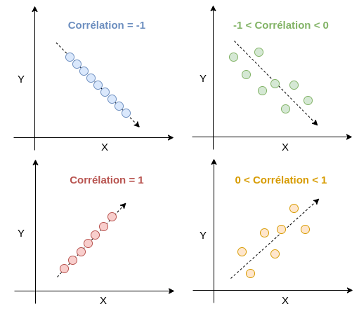

### Matrice de variance-covariance

La matrice de variance-covariance regroupe sur sa diagonale la variance de chaque variable aléatoire.

Cette matrice est symétrique car pour rappel $Cov(X,Y)=Cov(Y,X)$.

Voici un exemple général pour la construction d'une matrice variance-covariance.
$$
\begin{bmatrix} Var(X_1) & Cov(X_1, X_2) & ... & Cov(X_1,X_n) \\ Cov(X_2, X_1) & Var(X_2) & ... & Cov(X_2,X_n) \\ ... & ... & ... & ... \\ Cov(X_n, X_1) & Cov(X_n, X_2) & ... & Var(X_n) \end{bmatrix}
$$

Pour notre série d'échantillon, notre matrice peut être représentée de la manière ci-dessous.

$$
\begin{bmatrix} Var(taille) & Cov(taille;poids) \\ Cov(poids;taille) & Var(poids) \end{bmatrix}
$$

Après le calcul, nous obtenons ce résultat:
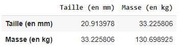

Dans le cas bidimensionnel, lorsqu'il y a corrélation entre deux variables et que l'on représente les données par des points sur un graphique on peut observer une dispersion de ces points en "ballon de rugby".

On peut en déterminer le barycentre (moyenne des points).

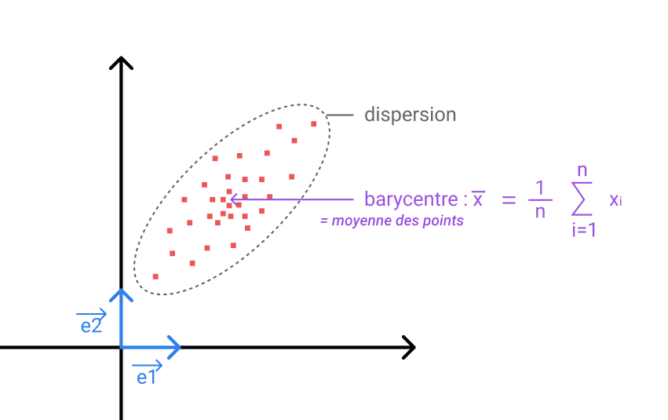

On peut ensuite chercher à centrer ce "ballon de rugby" sur le graphique. Il faut créer une matrice des données centrées $X^C_{n, p}$ à partir de notre matrice qui contient les données $X_{n,p}$ avec $n$ étant le nombre de lignes et $p$ le nombre de colonnes. Le principe est de soustraire la moyenne de chaque colonne à chaque valeur de la colonne correspondante.

Formule:
$$
X^c_{n,p=2} = X_{n,p=2} - \begin{bmatrix} 1 \\ 1 \\ ... \\ 1 \end{bmatrix} \begin{bmatrix} \overline{x} & \overline{y}  \end{bmatrix} = \begin{bmatrix} x_1 - \overline{x} & y_1 - \overline{y}  \\ ... & ...  \\ x_n - \overline{x} & y_n - \overline{y} \end{bmatrix}
$$

Après, on obtient le résultat ci-dessous.

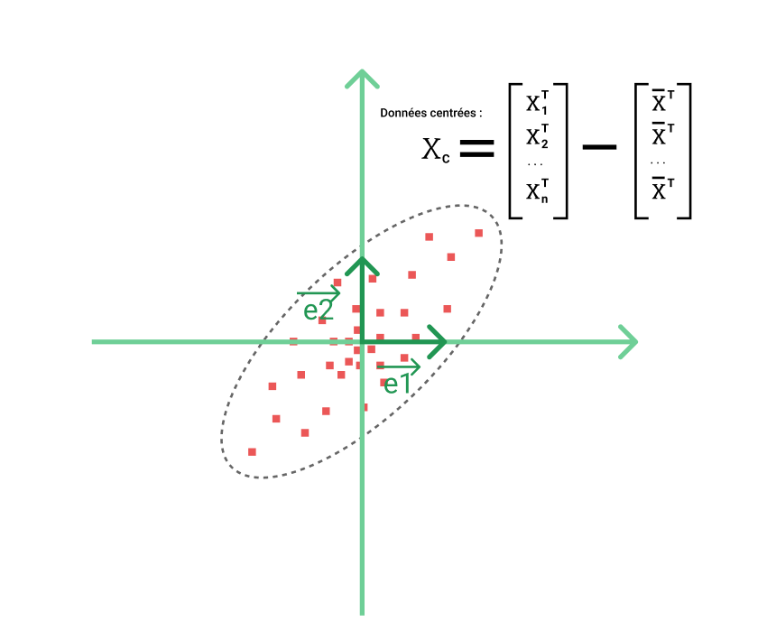

Ensuite on peut chercher à incliner ces données, à leur appliquer une rotation afin de supprimer la corrélation.

Pour se faire on doit déterminer l'axe principal d'inertie, qui correspond à la droite de régression, et le second axe principal, perpendiculaire au premier.

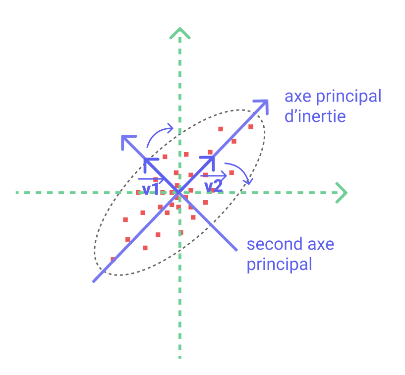

On peut ensuite changer de base pour passer dans celle formée par les vecteurs $\vec{v_1}$ $\vec{v_2}$

Les vecteurs $\vec{v_1}$ $\vec{v_2}$ sont les valeurs propres de la matrice de covariance.

### Calcul des valeurs et vecteurs propres

Pour calculer les valeurs propres il faut résoudre le système :

$Det(A-(\lambda)*I)=0$

Pour une matrice 2X2 on a une équation de degré 2 à résoudre.

Pour notre cas de figure : 11.64152491 et 139.97137832

On a aussi les vecteurs propres : 
- [-0.96319528, -0.26880261]
- [ 0.26880261, -0.96319528]

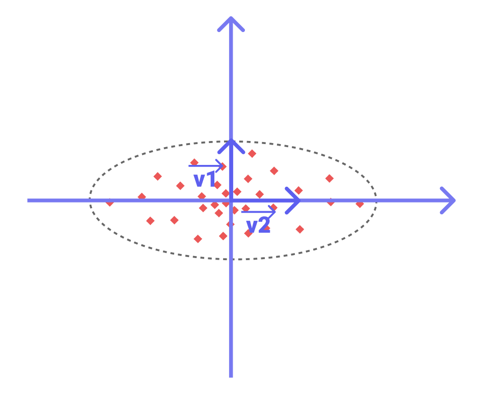

### Droite de régression
#### Paramètres de position et de dispersion minime 

La droite de régression linéaire est la droite de forme :
${y=ax+b}$
Il s’agit de trouver la droite où la distance/l’écart entre les points et la droite est minimal.
Il y a plusieurs méthodes pour trouver une solution, mais généralement on utilise la méthode des moindres carrés, qui consiste à trouver le carré de la différence entre le point théorique et le point expérimental : ${(y_i-(ax_i+b))^2}$

l’écart total :

Pour le calcul des coefficients a et b, on a un Théorème.
Si la variance Var(X) de la série statistique ${X=(x_i)}$ est non-nulle, il existe une unique droite qui minimise la quantité J(a,b).

Elle vérifie :

${a=\frac{Cov(X,Y)}{Var(X)}}$

${b=\bar y-a\bar x}$

où Cov(X,Y) désigne la covariance de X et de Y, ${\bar x}$ la moyenne des $\bar x_i$ et ${\bar y}$ la moyenne de $\bar y_i$. 

Les autres méthodes sont : La droite médiane-médiane

https://www.alloprof.qc.ca/fr/eleves/bv/mathematiques/la-droite-de-regression-m1378

La droite médiane-médiane

Cette méthode est très efficace lorsqu'il y a un nombre important de données et que celles-ci sont très dispersées. Dans ce cas, la médiane vient relativiser le tout et diminue l'impact des données aberrantes dans les calculs. En effet, la médiane-médiane est réputée plus robuste que des méthodes telles que la méthode des moindres carrés. De plus, cette méthode nécessite peut de calcul. Il suffit de faire 2 découpages, une étant la valeur médiane sur X (avec les données rangées par ordre croissant) et l'autre sur la médiane de l'axe Y. 

La droite de mayer:
Etant donnée les calculs de moyenne, cette methode est plus rapide à executer. Cependant, contrairement à la droite médiane-médiane, la droite de mayer est très sensible aux données aberrantes. Les deux methodes sont donc complémentaire en fonction du type de donnée utilisé.

Pour trouver la droite de mayer, on commence par classer les données par ordre de taille selon un critère puis les séparer en deux groupes de meme taille si possible. Ensuite on calcul les moyennes des points de chaques groupe. La droite de mayer est la droite passant par les deux moyennes calculées. 

## Simulation 

Fait sur un Google Colab : https://colab.research.google.com/drive/1jyI4THpgjfKi763jVLNzr_3Pt4XDo3gk?usp=sharing

Alternativement copie fait du pdf à la fin du pdf

## Échantillonnage

### Introduction

En général il n'est pas possible de réaliser une étude sur l'ensemble d'une population car le nombre d'éléments à étudier est trop important. Dans ce cas on a recours à l'échantillonnage.

L’échantillonnage consiste à sélectionner une sous-partie représentative d’un ensemble d'individus ou, de manière générale, d'un groupe d'éléments varié, afin de produire une série d’échantillons à étudier.

### Différents types d'échantillonnages

- Échantillonnage aléatoire et simple : le tirage des individus de l'échantillon est aléatoire, c'est-à-dire que chaque individu a la même probabilité d'être choisi, et simple, c'est-à-dire que les choix des différents individus sont réalisés indépendamment les uns des autres.
- Échantillonnage systématique : le premier individu est choisi de manière aléatoire, puis les suivants sont déterminés à intervalle régulier. Par exemple, dans un verger, on choisit au hasard le 7e pommier, puis les 27e, 47e, 67e, etc.
- Échantillonnage stratifié : on subdivise la population en plusieurs parties avant de prendre l'échantillon.
- Échantillonnage par quotas : la composition de l'échantillon doit être représentative de celle de la population selon certains critères jugés particulièrement importants. On utilise cette méthode pour réaliser les sondages d'opinions.

#### Cas pratique : sondage des élections présidentielles

En France on utilise la méthode des quotas. Elle consiste à interroger un échantillon représentatif de la population, en s'appuyant sur les statistiques de l'Insee.

