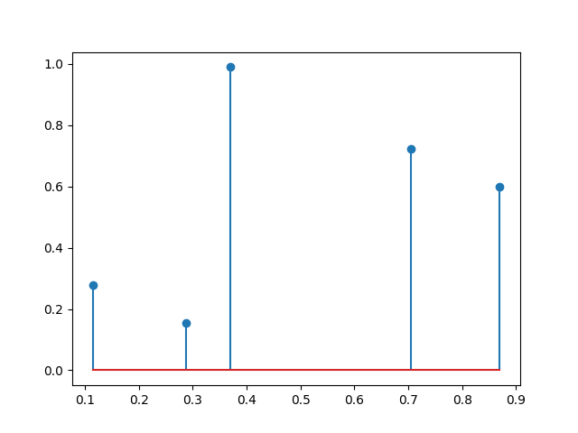

# Statistique

## Statistique descriptive unidimensionnelle (Charly)

### Paramètres de position

#### Moyennes

- symbole : $\bar x_A$ ou $\bar x$
- formule : 
  - non-pondéré : $\bar x_A = {1\over n} \sum_{i=0}^{n} x_i$ 
  - pondéré :  $W = {1\over \sum_{i=0}^{n} w_i} \sum_{i=0}^{n} w_ix_i$

La moyenne est un paramètre visant à resumer toutes les données en une seule valeur.

Une bonne repésentation visuelle de la moyenne est que la moyenne est le point qui minimise la distance cumulative avec toutes les données :

On peut vouloir apporter une importance non uniforme aux données, pour ce faire on va utiliser des poids qui vont multiplier chacune des valeurs de données.

#### Quantile

Le quantile est un paramètre de position qui permet de connaître la valeur max des $N \over quantile$ premiers $x$

- Symbole : $q_{quantile}$
- formule : 
  $$
  x_i \ où \ i \in \N \land i > {n \over quantile} \land min(i)
  $$

##### Quartile

Un quartile est un quantile de valeur spécifique. Il existe trois quartiles Q1, Q2 et Q3 qui représentent respectivement 25% 50% et 75% des données

- Symboles :
  - $Q1$
  - $Q2$
  - $Q3$

##### Médiane

La médiane est le Q2, elle indique la valeur du milieu des données. Elle est souvent utilisée de pair avec la moyenne arithmétique car elle n'est pas sensible aux extrêmes.

Lorsque la médiane est supérieure à la moyenne c'est qu'il y a de petites valeurs extrêmes et lorsque la médiane est inférieure à la moyenne on a de fortes valeurs extrêmes. 

- Symbole : $Q2$ ou $Me$

### Paramètres de dispersion

Dispersion statistique : la dispersion statistique mesure la variabilité des valeurs d’une série statistique par rapport à une valeur centrale (moyenne). Elle permet de déterminer la dispersion et l’écart entre les différentes valeurs.

#### Paramètres de dispersion absolue

##### Étendue

L'étendue est la différence entre la valeur minimale et maximale. 

L'étendue de $X$ est $X_{max} - X_{min}$

##### Écart absolu moyen
Ce paramètre est la moyenne arithmétique de la valeur absolue des écarts à la moyenne. C'est donc la "distance moyenne à la moyenne".
$\frac{1}{n}\sum_{i=1}^n \left|x_i - \overline{x}\right|$

##### Equart-type
L'écart-type est une mesure de dispersion par rapport à la moyenne.
- Symbole :  $\sigma$
- Formule : $p_i = P(X = x_i)$

##### Variance
La variance est une mesure de la dispersion des valeurs d'un échantillon ou d'une distribution de probabilité.
- Symbole : $V$
- Formule : $\sigma = \sqrt{V} = \sqrt{\frac{1}{n}\sum_{i=1}^n (x_i-\overline{x})^2} = \sqrt{\frac{1}{n}\sum_{i=1}^n x_i^2 - \overline{x}^2}$
- 

#### Paramètres de dispersion relative
Les paramètres de dispersion relative permettent de comparer deux distributions à ordre de grandeur ou d’unité de mesure différente.
- le coefficient interquartile relatif
C.I.R.(X)  = (Xq3-Xq1)/ médiane X
- l'écart moyen relatif
E.M.R.(X)  = E.A.M.(X)  / moyenne(X)
- le coefficient de variation
C.V.(X)  = s(X)  / moyenne(X)

#### Mise en application sur notre jeu de données

Masse (kg) \ Taille (cm)|	160-165|	165-170|	170-175|	175-180|	180-185|	185-190|Cumulés|
------------------------|----------|-----------|-----------|-----------|-----------|-----------|-------|
45-50|	1|	|	|	|	|	| 1 |
50-55|	|	|	4|	1|	|	|5|
55-60|	|	1|	1|	1|	|	|3|
60-65|	|	|	3|	2|	|	|5|
65-70|	|	|	1|	3|	1|	|5|
70-75|	|	|	2|	4|	1|	|7|
75-80|	|	|	|	1|	2|	|3|
80-85|	|	|	|	|	|	|0|
85-90|	|	|	|	|	|	|0|
90-95|	|	|	|	1|	|	|1|
95-100|	|	|	|	|	1|	|1|
Cumulés|	1|	1|	11|	13|	5|	0|31|

|Indicateur|Taille (cm)|Masse (kg)|
| -------- | ----------|----------|
|Min|162,5|47,5|
|Max|182,5|97,5|
|Moyenne|175,7258065|66,53225806|
|Médiane|177,5|67,5|
|1er quartile | 172,5 | 57,5 |
|3e  quartile | 177,5 | 72,5 |

### Représentation

Il existe de nombreux types de diagramme permettant de representer des données statistiques. Suivant les données à représenter, certaines répresentations sont plus adaptées que d'autres. Nous avons decidé de présenter et critiquer quelques diagrammes qui nous semblent pertinents à utiliser pour notre jeu de données.

#### Diagramme en bâtons (charly gdoc)

##### Description

Pour construire un diagramme en bâtons, il faut placer les points correspondant à nos valeurs sur un graphique, et pour chaque point tracer un trait vertical qui part du point concerné et qui s’arrête sur l’axe des abscisses.

##### Représentation

Pour le diagramme suivant, nous avons utilisé cette suite de points générée de manière aléatoire :

|   x   |   y   |
|---|---|
| 0.87009423 | 0.59815531 |
| 0.28730304 | 0.15536838 |
| 0.11426581 | 0.27674868 |
| 0.70423289 | 0.72387041 |
| 0.3701205 | 0.98997792 |

#### Diagramme cumulatif

##### Description

Ce diagramme permet de représenter graphiquement la distribution des effectifs. Il se base donc sur l’effectif cumulé. On peut exprimer l’effectif cumulé d’une valeur comme étant la somme de l’effectif de cette valeur plus les effectifs qui lui sont inférieurs.

##### Représentation

Pour cette partie, nous avons utilisé la suite de valeurs générée de manière aléatoire décrite ci-dessous. Par exemple, avec cette dernière, si l'on veut l’effectif cumulé de la 3ème valeur (v3), on fait $1 + 2 + 1$ soit $4$. Si on veut celle de la 5ème on fait $v3 + 3 + 2$ soit $9$. 

| x | y |
|---|---|
| 1 | 1 |
| 2 | 2 |
| 3 | 1 |
| 4 | 3 |
| 5 | 2 |

La représentation graphique de l’effectif cumulé de la suite ci-dessus est la suivante :

#### Histogramme

##### Description

L'histogramme représente la répartition empirique d'une variable aléatoire en la représentant avec des colonnes. Ces dernières portent le nom de **classe**.

Dans un histogramme, les classes sont représentées par un rectangle. La hauteur d'un rectangle représente la quantitée de valeur de cette classe.

Si l'on dispose d'une suite de valeur, il existe plusieurs formules pour choisir le nombre de classes. Entre autres, il y a celle de Herbert Sturges qui définit que pour un nombre de valeur $N$ on suggère un nombre de $K$ classes avec $K  = 1 + \log_{2}(N) \approx  1 + \frac{10}{3}\log_{10}(N)$ .

On parle de l'amplitude d'un histogramme comme étant la plage sur laquelle est définie l'histogramme. Elle se calcule avec la formule suivante : $A = Vmax - Vmin$ .

Par conséquent, la largeur d'une classe peut être calculée comme suit : $W = A / K$ .

L'histogramme est un moyen rapide et efficace de voir la répartition d'une certaine valeur.

##### Représentation

Pour le diagramme ci-dessous, nous avons utilisé les données relatives au poids des personnes de la classe ainsi que la bibliothèque [matplotlib](https://matplotlib.org/) de python.

Dans notre cas, nous n'avons pas eu besoin de calculer le nombre de classes ainsi que leurs largeurs car les données ont été prélevées sur une plage de 5 en 5 ([45kg;50kg[,[50kg;55kg[, ...).

#### Diagramme en boîte / box-plot

##### Description

Le diagramme en boîte, connu aussi sous le nom de boîte à moustaches ou boîte de Tukey, permet de visualiser l'essentiel d'une série statistique.

On y retrouve la médiane, les quartiles, la valeur miniamle et maximale.

##### Représentation

Pour le diagramme ci-dessous, nous avons utilisé les données relatives au poids des personnes de la classe ainsi que la bibliothèque [matplotlib](https://matplotlib.org/) de python.

Sur ce diagramme, nous pouvons constater la médiane, barre orange dans la boite, la valeur minimale, trait du bas, la valeur maximale, trait du haut. La distance entre la valeur maximale ou la valeur minimale et la boîte représente chacune 25% de la totalité des valeurs. Cela fait que la boite en elle même représente 50% des valeurs.

On peut aussi voir que la valeur `97,5` est considérée comme aberrante car elle n'est pas à l'intérieur de la moustache. Cela veut dire qu'elle mérite une réexamination pour voir si elle est vraiment aberrante ou non. Nous nous sommes rendu compte à terme que c'était bien le cas.

## Statistiques descriptives bidimensionnelles

### Loi jointe
**Définition** : Soit (X,Y) un vecteur aléatoire réel. On appelle loi conjointe de (X,Y) la probabilité définie sur R2 par :
${P_{(X,Y)}(I \times J)=\mathbb {P} (X \in I\ et\ Y \in J)}$

Les lois de probabilité de $X$ et $Y$ sont alors appelées lois marginales de $(X,Y)$.

paramètres de position et de dispersion

En particulier, lorsque $X$ et $Y$ sont à valeurs finies, la loi conjointe de $(X,Y)$ est l'ensemble des ${{P}((X=x_{i}) \cap (Y=y_{j})) }$

tableau

### Lois unidirectionnelle ou marginale

La loi marginale d'une variable aléatoire à plusieurs dimensions est la loi de probabilité d'une de ses composantes.

Il est toujours possible, à l'aide de la loi conjointe, de retrouver les lois marginales : 

si ${X(\Omega)= \{x_{1}, ... , x_{p}}\}$ et ${Y(\Omega)= \{y_{1}, ... , y_{p}}\}$,

on a : ${{P} (X = x_{i})=\sum _{j=1}^{q} {P} (X = x_{i}, Y = y_{j})}$

Si les composantes sont indépendantes on a la propriété suivante :

${{P}(X = x_{i},Y = y_{j})= {P} (X = x_{i}) \times {P} (Y = y_{j})}$

sinon dans le cas contraire on a:

${{P}(X = x_{i},Y = y_{j})= {P} (X = x_{i}) \times {P} (Y = y_{j} | X = x_{i})}$
